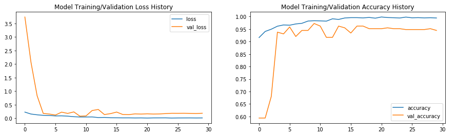
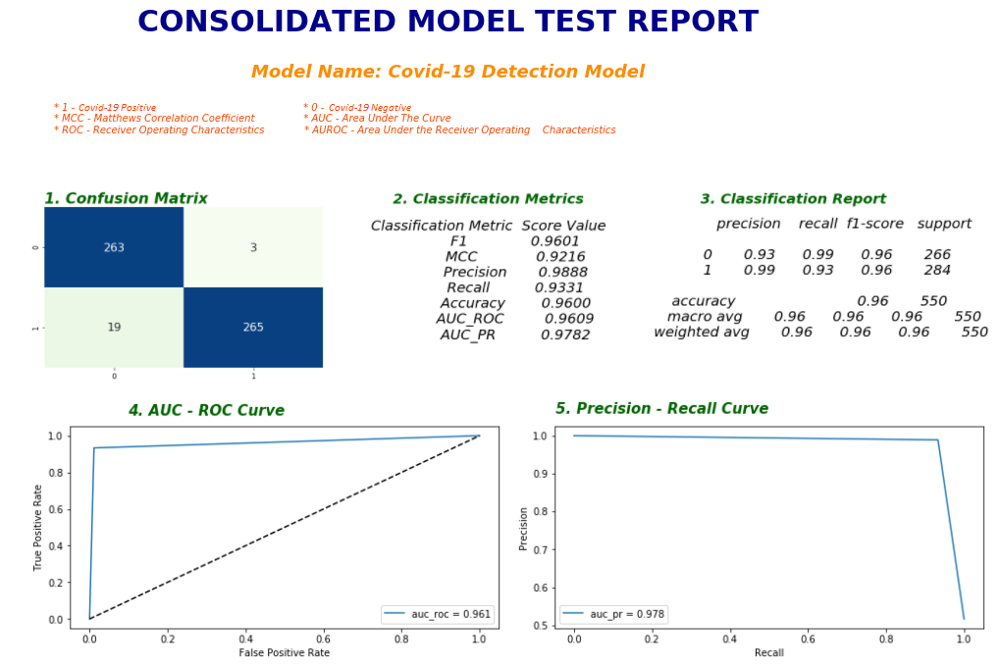

# Covid-19-Detection-using-Deep-Learning
An AI and Deep Learning based solution to help diagnose the presence of Covid-19 infection by analyzing the chest X-Ray images.

### Dataset Descripion

The dataset used for this study is a combination of the below mentioned datasets from which the **`NORMAL`** and the **`COVID-19 INFECTED`** chest x-ray images have been extracted.

#### Constituent Datasets

The dataset contains the images collected from the following 3 datasets.

1. https://www.kaggle.com/praveengovi/coronahack-chest-xraydataset
2. https://github.com/ieee8023/covid-chestxray-dataset
3. https://www.kaggle.com/paultimothymooney/chest-xray-pneumonia

#### Model Details
Two models were created - 
1. Custom CNN Model.
2. Transfer Learning Model using EfficientNet-B0 pre-trained model.

#### Training History
The training phase metrics for the transfer learning model can be seen in the following image -

#### Test Time Metrics
The following chart shows a consolidated report of the model testing -

#### Deployment
The application is deployed at https://diagnose-covid19.herokuapp.com/
